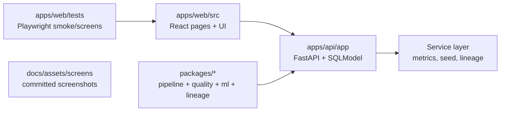

# LakehouseOps

[](../../actions/workflows/ci.yml)


A Databricks-style lakehouse control plane demo with medallion data assets, pipeline operations, quality monitoring, lineage exploration, and lightweight model registry workflows.

## Hero screenshots


| Overview | Runs | Lineage |
|---|---|---|
|  |  |  |
| Tables | Quality | Models |
|  |  |  |

## 2-minute demo

```bash
make up      # terminal 1: api
make ui      # terminal 2: web app
```

1. Open `http://localhost:5173/` and click **Start demo**.
2. Open **Runs** and inspect timeline/log/artifact detail dialog.
3. Open **Tables** and switch bronze/silver/gold tabs.
4. Open **Quality** to inspect pass/fail badges and failing rows sample.
5. Open **Lineage** and click nodes to inspect upstream/downstream and quality context.
6. Open **Models** and click **Promote to Production**.

## Why this matches Databricks

- **Medallion architecture** with bronze/silver/gold datasets and ownership metadata.
- **Pipeline orchestration UX** with filterable run history, per-step timeline, logs, and artifacts.
- **Lineage exploration** with dependency graph navigation and upstream/downstream context.
- **Data quality controls** with pass/fail rules and failure payload samples.
- **Model registry flow** with staged artifacts and one-click promotion.
- **Drift visibility** via model drift scores and overview KPI rollups.

## Repo map



- `apps/api/app/` — FastAPI routes, SQLModel tables, service layer.
- `apps/web/src/` — React app shell, pages, reusable UI components.
- `apps/web/tests/` — Playwright smoke + screenshot scripts.
- `packages/` — shared pipeline/quality/ml/lineage Python packages.
- `tests/` — Python API and package tests.
- `docs/` — docs pages + committed UI screenshots.

## CI artifacts

- `web-dist` from `apps/web/dist`
- `docs-site` from `mkdocs build --strict`
- `ui-screenshots` from `docs/assets/screens`
