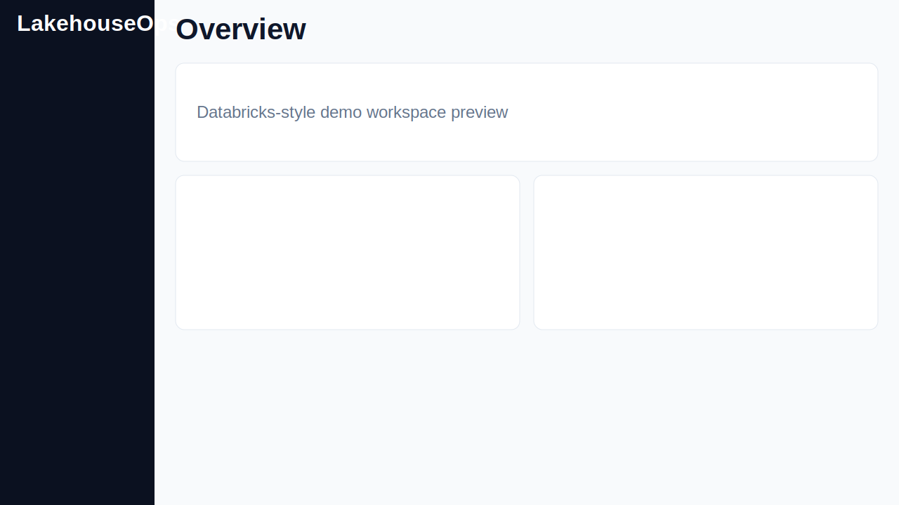
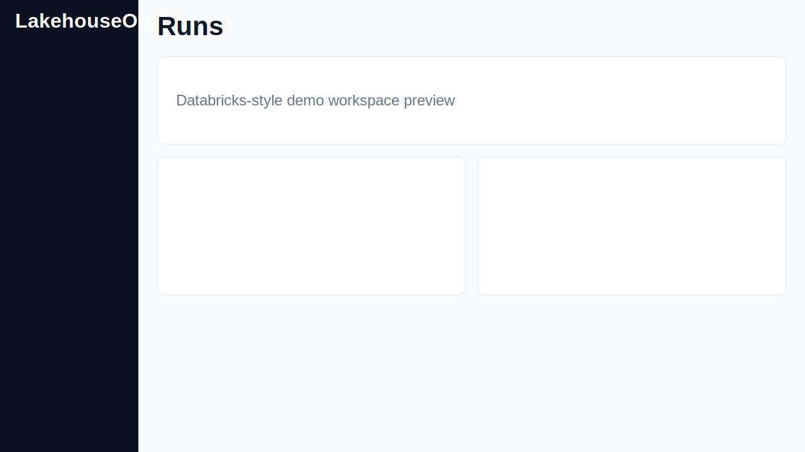
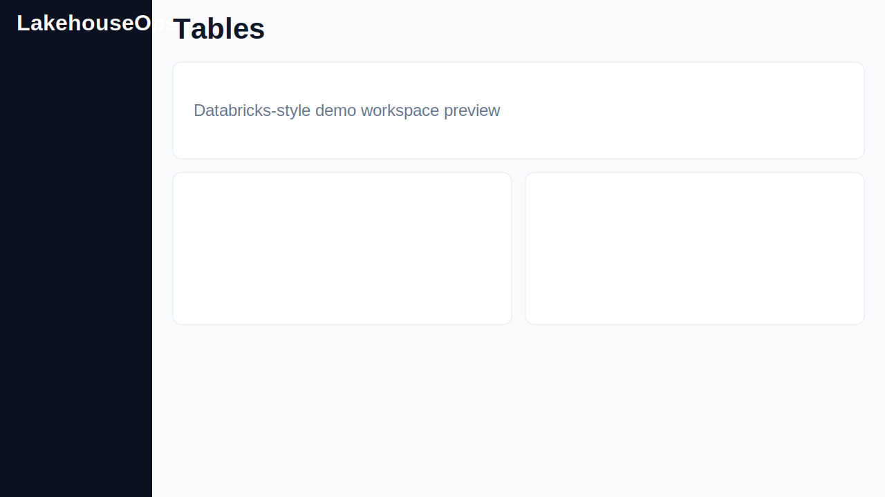

# LakehouseOps


A Databricks-style lakehouse control plane demo with medallion data assets, pipeline operations, quality monitoring, lineage exploration, and lightweight model registry workflows.

## Product Preview



Additional screens:
- 
- 
- 
- 
- 

## 2-minute demo

```bash
make up      # terminal 1: api
make ui      # terminal 2: web app
```

1. Open `http://localhost:5173/admin` and click **Seed demo data**.
2. Go to **Overview** and click **Run Demo Pipeline**.
3. Open **Runs** and inspect a run detail modal (timeline/logs/artifacts).
4. Open **Tables** and switch bronze/silver/gold tabs.
5. Open **Quality** to inspect pass/fail badges and failing rows sample.
6. Open **Lineage** and click nodes to highlight upstream/downstream paths.
7. Open **Models** and click **Promote to Production**.

## Architecture

```mermaid
flowchart LR
  subgraph Web[apps/web React UI]
    Pages[Overview · Runs · Tables · Quality · Lineage · Models · Admin]
  end

  subgraph API[apps/api FastAPI]
    Endpoints[/overview/metrics\n/runs\n/datasets\n/quality\n/lineage\n/models\n/admin/demo/*]
    Services[demo seeding · run simulation · promotion]
  end

  subgraph Data[data + sqlite]
    DB[(SQLite)]
    Lake[data/raw bronze silver gold]
  end

  Web --> API
  API --> DB
  API --> Lake
```

## Feature highlights (Databricks feel)

- Medallion table views (bronze/silver/gold) with drift indicators.
- Pipeline run operations with timeline/log/artifact details.
- Quality rules + failures samples + trend summaries.
- Interactive lineage graph with node detail and highlights.
- Model registry cards with stage promotion workflow.
- Admin controls to seed/reset realistic demo data.

## Repo map

- `apps/api/app/` — FastAPI routes, SQLModel tables, service layer.
- `apps/web/src/` — React app shell, pages, reusable UI components.
- `apps/web/tests/` — Playwright smoke + screenshot scripts.
- `packages/` — shared pipeline/quality/ml/lineage Python packages.
- `tests/` — Python API and package tests.
- `docs/` — docs pages + committed UI screenshots.

## CI artifacts

- `web-dist` from `apps/web/dist`
- `docs-site` from `mkdocs build --strict`
- `ui-screenshots` from `docs/assets/screens`
